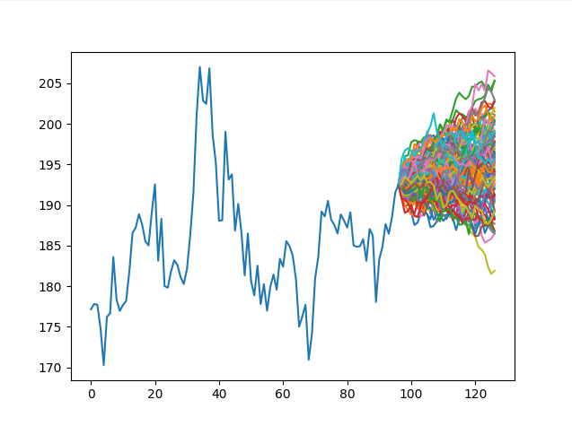

<h1 align="center">📊 Stan's Stock Market Analyser</h1>
A Python-based stock market analysis tool for exploring historical price data, identifying trends, and generating price predictions.
Planned features include a user-friendly graphical interface, support for importing custom trading strategies, and tools for benchmarking their performance against historical and simulated market data.

 Showcase: 
NVDA 1/30/2026 
A thousand, thirty-day simulations with one simulation per day

## License
This project is source-available for viewing and personal use only.
Redistribution or commercial use is not permitted.
