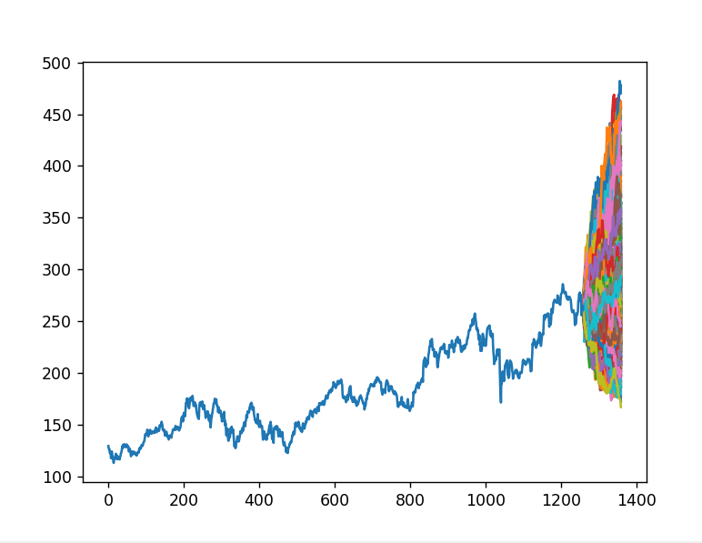
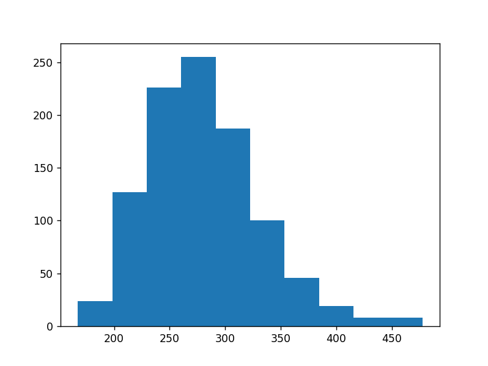
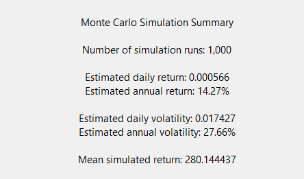

<h1 align="center">📊 Stan's Stock Market Analyser</h1>
A Python-based stock market analysis tool for exploring historical price data, identifying trends, and generating price predictions.
Planned features include a user-friendly graphical interface, support for importing custom trading strategies, and tools for benchmarking their performance against historical and simulated market data.

## Showcase
AAPL 2/21/2026 
A thousand, hundred-day simulations with one simulation per day 

  

  

  

## Install-linux 

1) git clone [repo] 
2) cd brownian_model 
3) Create a python virtual enviroment to install the packages 
  - sudo apt install python3-venv 
  - python3 -m venv venv 
  - source venv/bin/activate 
    - you will know that you are in the virtual enviroment when (venv) apears 
  - pip install -r requirements.txt 
    - installs all required packages 
4) cd app 
5) python main.py 
## License
This project is source-available for viewing and personal use only.
Redistribution or commercial use is not permitted.
